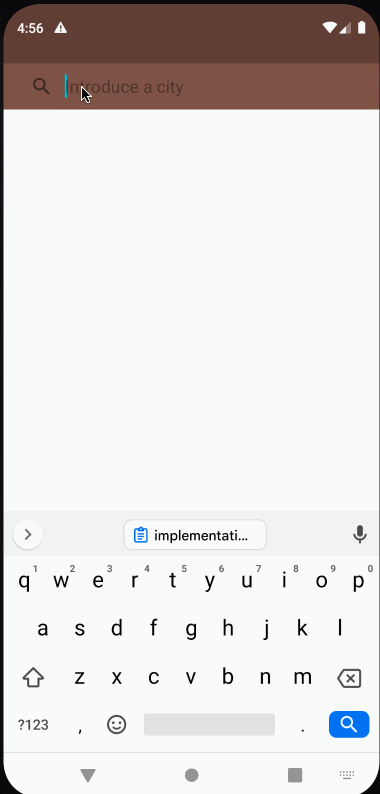
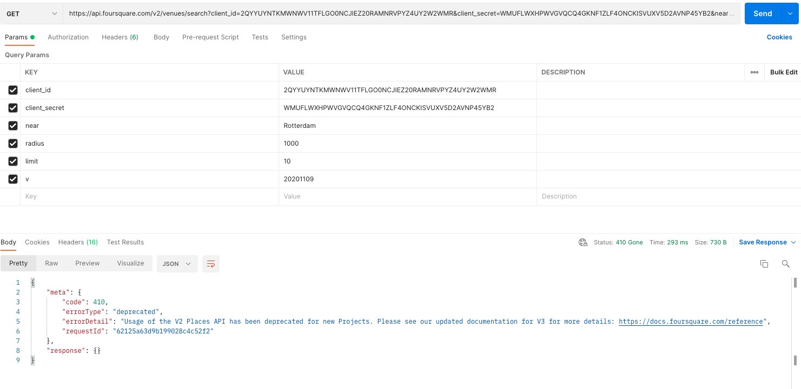

## CoolBlue Search

- This is an app that allows to you search products like the following gif

#This project is using:
 
- Clean architecture  
- MVI
- has animation (maybe the animation could be weird in the list is just to show that knowledge)
- Dagger 2 as a dependency injector
- Flow
- Coroutines
- Groupie 
- Android Navigation
- View binding
- Retrofit 
- Glide
- Room

#Foursquare API 
- For this project I use foursquare v3 with places instead of v2 with venues.

- The main difference there is the property id (now is fsq_id) and the filters that you can provide to the search.

#Cache strategy
- This could be better, actually the fetch information from the api is always called inside of networkBoundResource. 
  But if we modify the parameter should fetch we can define our own strategy
